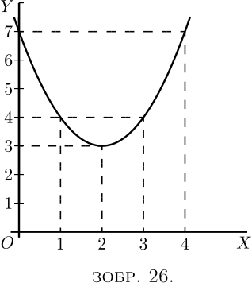
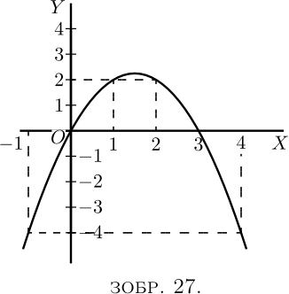
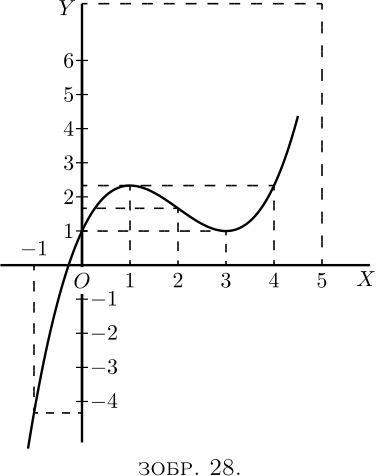
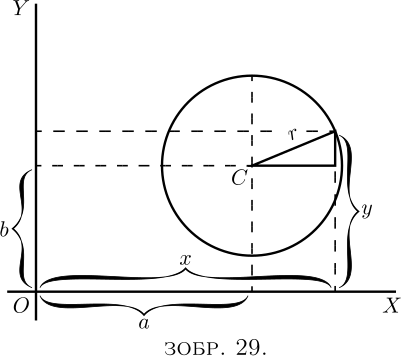
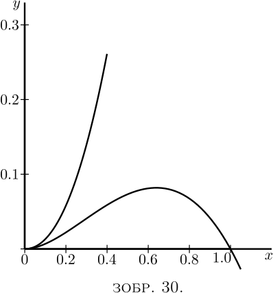

# XI. Максимуми та мінімуми

Одне з головних застосувань процесу диференціювання полягає в тому, щоб
з’ясувати, за яких умов значення диференційованої речі стає максимальним
або мінімальним. Це часто надзвичайно важливо в інженерних питаннях, де
найбільш бажано знати, які умови зведуть вартість роботи до мінімуму або
зроблять ефективність максимальною.

Щоб почати з конкретного випадку, візьмемо рівняння 

$$ y = x^2 - 4x + 7. $$

Присвоюючи кілька послідовних значень $x$ і знаходячи відповідні
значення $y$, ми можемо легко побачити, що рівняння представляє криву з
мінімумом.

|     |        |         |        |        |     |         |
|-----|--------|---------|--------|--------|-----|---------|
| $x$ | $0$    | $1$     | $2$    | $3$    | $4$ | $5$     |
| $y$ | $7$    | $4$     | $3$    | $4$    | $7$ | $12$    |

Ці значення нанесено на графік на [Зображенні 26](#figure26), яке
показує, що $y$ має очевидно мінімальне значення $3$, коли $x$ дорівнює
$2$. Але чи впевнені ви, що мінімум виникає у $2$, а не у
$2 \tfrac{1}{4}$ чи $1
  \tfrac{3}{4}$?

Звичайно, з будь-яким алгебраїчним виразом можна було б розрахувати
багато значень і таким чином поступово прийти до конкретного значення,
яке може бути максимальним або мінімальним. 

Ось інший приклад:

Let $y = 3x - x^2$.

Обчислимо кілька значень таким чином:

|     |      |     |     |     |     |      |       |
|-----|------|-----|-----|-----|-----|------|-------|
| $x$ | $-1$ | $0$ | $1$ | $2$ | $3$ | $4$  | $5$   |
| $y$ | $-4$ | $0$ | $2$ | $2$ | $0$ | $-4$ | $-10$ |

Побудуємо ці значення, як на [Зображенні 27](#figure27).

Буде очевидно, що максимум буде десь між $x = 1$ і $x = 2$; і ця річ
*виглядає* ніби максимальне значення $y$ має становити близько $2
  \tfrac{1}{4}$. Спробуємо деякі проміжні значення. Якщо
$x = 1 \tfrac{1}{4}$, $y = 2.187$; якщо $x = 1 \tfrac{1}{2}$,
$y = 2.25$; якщо $x = 1.6$, $y =
  2.24$. Як ми можемо бути впевнені, що $2.25$ є справжнім максимумом,
або що максимум виникає саме тоді, коли $x = 1 \tfrac{1}{2}$?

Зараз це може здатися жонглюванням, щоб переконати вас, що існує спосіб,
за допомогою якого можна отримати максимальне (або мінімальне) значення,
не роблячи багатьох попередніх проб чи припущень. І цей спосіб залежить
від диференціювання. Перегляньте попередню сторінку
([тут](10.md#curve)), на [Зображення 14](#figure14) і [Зображення
15](#figure15), і ви побачите, що щоразу, коли крива досягає
максимальної або мінімальної висоти, у цій точці її $\dfrac{dy}{dx} =
  0$. Це дає нам підказку до потрібного засобу: коли перед вами постає
рівняння, і ви хочете знайти те значення $x$, яке зробить його $y$
мінімумом (або максимумом), *спочатку продиференціюйте рівняння*, а
після цього запишіть його $\dfrac{dy}{dx}$ як таке, що *дорівнює нулю*,
і знайдіть $x$, розв'язавши рівняння. Підставте це конкретне значення
$x$ до початкового рівняння, і тоді ви отримаєте необхідне значення $y$.
Цей процес зазвичай називають «прирівнюванням до нуля».

Щоб побачити, як просто це працює, візьмемо приклад, з якого починається
цей розділ, а саме $$ y = x^2 - 4x + 7. $$ Диференціюючи, отримуємо: $$
  \dfrac{dy}{dx} = 2x - 4. $$ Тепер прирівняємо це до нуля, таким чином:
$$ 2x - 4 = 0. $$
Розв’язуючи це рівняння для $x$, ми отримуємо:
$$\begin{align*} 2x &= 4, \\ x &= 2. \end{align*}$$
Тепер ми знаємо, що максимум (або мінімум) настане саме тоді, коли
$x=2$.

Додавши значення $x=2$ до початкового рівняння, ми отримаємо
$$\begin{align*} y &= 2^2 - (4×2) + 7 \\ &= 4 - 8 + 7 \\ &= 3.
\end{align*}$$

Тепер подивіться на [Зображення 26](#figure26), і ви побачите, що
мінімум настає, коли $x = 2$, і цей мінімум $y = 3$.

Спробуємо другий приклад ([Зображення 24](#figure24)), що є
$$\begin{align*} y &= 3x - x^2. \\ \text{диференціюючи,}\ \frac{dy}{dx}
&= 3 - 2x. \\ \end{align*}$$
Прирівнювання до нуля, 
$$\begin{align*} 3 - 2x &= 0, \\ \text{звідки}\ x &= 1 \tfrac{1}{2}; \end{align*}$$
і підставивши це значення $x$ до початкового рівняння, ми знаходимо:
$$\begin{align*} y &= 4 \tfrac{1}{2} - (1 \tfrac{1} {2} × 1
\tfrac{1}{2}), \\ y &= 2 \tfrac{1}{4}. \end{align*}$$
Це дає нам саме ту інформацію, щодо якої метод спроби багатьох 
значень залишав нас невпевненими.

Тепер, перш ніж ми перейдемо до будь-яких подальших випадків, ми маємо
зробити два зауваження. Коли вам говорять прирівняти $\dfrac{dy}{dx}$ до
нуля, ви спочатку відчуваєте (тобто якщо у вас є хоч якийсь розум) якесь
обурення, тому що ви знаєте, що $\dfrac{dy} {dx}$ має різноманітні
значення в різних частинах кривої, залежно від того, нахилена вона вгору
чи вниз. Отже, коли вам раптом кажуть написати $$ \frac{dy}{dx} = 0, $$
ви обурюєтеся цим і відчуваєте схильність сказати, що це не може бути
правдою. Тож, вам треба зрозуміти істотну різницю між «рівнянням» і
«рівнянням умови». Зазвичай ви маєте справу з рівняннями, які є завжди
істинними. Але в деяких випадках, прикладом яких є даний момент, вам
доводиться записувати рівняння, які не обов’язково є істинними, але є
істинними лише при виконанні певних умов; і ви записуєте їх, щоб,
розв’язуючи, знайти ці умови. Зараз ми хочемо знайти конкретне значення
$x$, коли крива не має нахилу ані вгору, ані вниз, тобто в тому місці,
де $\dfrac{dy}{dx} = 0$. Тож, записуючи $\dfrac{dy}{dx} = 0$ ми *не*
кажемо, що ця похідна завжди $=0$; але ми це записуємо *як умову* щоб
побачити, скільки і яких вийде $x$, коли $\dfrac{dy}{dx}$ дорівнює нулю.

Другим зауваженням є те, яке (якщо у вас є хоч якийсь розум) ви,
напевно, вже зробили: а саме, що цей широко хвалений процес
прирівнювання до нуля зовсім не дає вам зрозуміти, чи $x$, який ви таким
чином знайдете, дає *максимальне* значення $y$ або *мінімальне*. Це
цілком так. Цей метод сам по собі не розрізняє; він знаходить для вас
правильне значення $x$, але залишає вам самотужки з’ясувати, чи є
відповідний $y$ максимумом чи мінімумом. Звичайно, якщо ви побудували
криву, ви вже знаєте відповідь на це.

Наприклад, візьмемо рівняння: $$ y = 4x + \frac{1}{x}. $$

Не замислюючись над тим, якій кривій воно відповідає, диференціюйте його
та прирівняйте до нуля: 
$$\begin{align*} \frac{dy}{dx} &= 4 - x^{-2} =
4 - \frac{1} {x^2} = 0; \\ \text{ звідки}\ x &= \tfrac{1}{2}; 
\end{align*}$$
і, підставивши це значення, 
$$y = 4$$
буде або максимумом, або мінімумом. Але чим саме? Пізніше
вам буде наданий спосіб, що залежить від другої похідної (див. [Розділ
XII.](12.md)). Але зараз буде достатньо, якщо ви просто спробуєте
будь-яке інше значення $x$, яке трохи відрізняється від знайденого, і
подивитеся, чи з цим значенням відповідне значення $y$ є меншим або
більшим за вже знайдене.

Спробуємо іншу просту задачу з максимуму і мінімуму. Припустимо, вас
попросили розділити будь-яке число на дві частини так, щоб їх добуток
був максимальним. Як би ви це зробили, якби не знали трюку прирівнювання
до нуля? Я припускаю, це можна зробити за правилом спроби, спроби й ще
раз спроби. Нехай числом буде $60$. Ви можете спробувати розрізати його
на дві частини та помножити їх разом. Таким чином, $50$ помножити на
$10$ дорівнює $500$; $52$ помножити на $8$ дорівнює $416$; $40$
помножити на $20$ дорівнює $800$; $45$ помножити на $15$ це $675$; $30$
помножити на $30$ дорівнює $900$. Це виглядає як максимум: спробуємо
порухати його. $31$ помножити на $29$ це $899$, що не дуже добре; і $32$
помножити на $28$ це $896$, що ще гірше. Тож здається, що найбільший
добуток вийде, розділивши число на дві рівні частини.

Тепер подивимось, що скаже нам математичний аналіз. Нехай число, яке
потрібно розрізати на дві частини, буде зватися $n$. Тоді, якщо $x$ є
однією частиною, інша частина буде $n-x$, а добуток буде $x(n-x)$ або
$nx-x^2$. Отже, ми пишемо $y=nx-x^2$. Тепер продиференціюємо та
прирівняємо до нуля; 
$$\begin{align*} \dfrac{dy}{dx} = n - 2x = 0 \\
\text{Розв'язуючи для $x$, отримуємо} \dfrac{n}{2} = x. \end{align*}$$
Отже, тепер ми *знаємо*, що яким би не було число $n$, ми
маємо розділити його на дві рівні частини, щоб добуток частин був
максимальним; і значення цього максимального добутку завжди буде $ = 
\tfrac{1}{4} n^2$.

Це дуже корисне правило, яке застосовується до будь-якої кількості
множників, тому, якщо $m+n+p=$ є постійним числом, $m×n×p$ є
максимальним, коли $m=n=p$.

*Тестовий приклад.*

Давайте відразу застосуємо наші знання до випадку, який ми можемо
перевірити. 
$$\text{Нехай } y = x^2 - x;$$
і давайте визначимо, чи має ця функція максимум чи мінімум; і якщо так,
перевіримо, чи це максимум, чи мінімум.

Диференціюючи, ми отримуємо

$$\begin{align*} 
\frac{dy}{dx} &= 2x - 1. \\ \text{ Прирівнюючи до нуля,
отримуємо }\ 2x - 1 &= 0, \\ \text{звідки}\ 2x &= 1, \\ \text{або }
x &= \tfrac{1}{2}. \end{align*}$$

 

Тобто, коли $x$ робиться $=\frac{1}{2}$, відповідне значення $y$ буде
або максимальним, або мінімальним. Відповідно, підставивши
$x=\frac{1}{2}$ у початкове рівняння, ми отримаємо 
$$\begin{align*} y &= (\tfrac{1}{2})^2 - \tfrac{1}{ 2}, \\ 
або \ y &= -\tfrac{1}{4}. \end{align*}$$
Це максимум чи мінімум? Щоб перевірити це, спробуємо підставити $x$
трохи більший за $\frac{1}{2},$ скажімо, зробити $x=0.6$. Тоді
$$ y = (0.6)^2 - 0.6 = 0.36 - 0.6 = -0.24, $$
що більше ніж $-0.25$; тобто $y = -0.25$ є *мінімумом*.

Побудуйте криву для себе та перевірте розрахунки.

*Більше прикладів*. Найцікавішим прикладом є крива, що має як максимум,
так і мінімум. Її рівняння: 
$$\begin{align*} y &=\tfrac{1}{3} x^3 -
2x^2 + 3x + 1. \\ Тепер \ \dfrac{dy}{dx} &= x^2 - 4x +3. \end{align*}$$

Прирівнюючи до нуля, ми отримуємо квадратне рівняння,
$$x^2 - 4x +3 = 0;$$
і його розв’язання дає нам *два* кореня, а саме
$$ \left\{\begin{aligned} x &= 3 \\ x &= 1. \end{aligned} \right. $$

Так, коли $x=3$, $y=1$; і коли $x=1$, $y=2\frac{1}{3}$. Перший з них —
мінімум, другий — максимум.

Сама крива може бути побудована (як на [Зображенні 28](#figure28)) зі
значень, розрахованих з початкового рівняння. Це показано нижче.

|     |                 |     |                |                |     |                |                |      |
|-----|-----------------|-----|----------------|----------------|-----|----------------|----------------|------|
| $x$ | $-1$            | $0$ | $1$            | $2$            | $3$ | $4$            | $5$            | $6$  |
| $y$ | $-4\frac{1}{3}$ | $1$ | $2\frac{1}{3}$ | $1\frac{2}{3}$ | $1$ | $2\frac{1}{3}$ | $7\frac{2}{3}$ | $19$ |

Подальшу вправу щодо максимумів і мінімумів надасть наступний приклад:

Рівняння кола радіуса $r$ із центром $C$ у точці з координатами $x=a$,
$y=b$, як показано на [Зображенні 29](#figure29), дорівнює: $$ (y-b)^2 +
  (x-a)^2 = r^2. $$ 

Це можна перетворити на $$ y = \sqrt{r^2-(x-a)^2} + b. $$

Ми заздалегідь знаємо, просто подивившись на зображення, що коли $x=a$,
$y$ матиме або максимальне значення, $b+r$, або мінімальне значення,
$b-r$. Але не будемо користуватися цим знанням; давайте приступимо до
пошуку того, яке значення $x$ зробить $y$ максимумом або мінімумом,
шляхом процесу диференціювання та прирівнювання до нуля.

$$\begin{align*} \frac{dy}{dx} &=
\frac{1}{2} \frac{1}{\sqrt{r^2-(x-a)^2}} × (2a-2x) , \\ \text{що
зводиться до}\ \frac{dy}{dx} &= \frac{a-x}{\sqrt{r^2-(x-a)^2}}.
\end{align*}$$

Тоді умова максимуму або мінімуму $y$:
$$ \frac{a-x}{\sqrt{r^2-(x-a)^2}} = 0.
  $$

Оскільки жодне значення $x$ не зробить знаменник нескінченним, єдиною
умовою для отримання нуля є $x = a.$
Підставивши це значення у початкове рівняння для кола, ми знайдемо
$$y = \sqrt{r^2}+b;$$
і оскільки корінь $r^2$ дорівнює $+r$ або $-r$, ми маємо два 
результуючих значення $y$:
$$\begin{align*} \left\{\begin{aligned}y \\ y\end{aligned}\right. &
\begin{aligned}= b & + r \\ = b & - r.\end{aligned} \end{align*}$$

Перший з них – максимум вгорі; другий - мінімум, внизу.

Якщо крива така, що немає місця для максимуму або мінімуму, процес
прирівнювання до нуля дасть неможливий результат. Наприклад:
$$\begin{align*} Нехай \ y &= ax^3 + bx + c. \\ Тоді \ \frac{dy}{dx} &=
3ax^2 + b. \end{align*}$$

Прирівнюючи це до нуля, ми отримуємо $3ax^2 + b = 0$, 
$$x^2 = \frac{-b}{3a},\\ \quad\text{і}\quad x = \sqrt{\frac{ -b}{3a}},\;
\text{ що неможливо.}$$ 
Тому $y$ не має ні максимуму, ні мінімуму.

Ще декілька опрацьованих прикладів дозволять вам досконало освоїти це
найцікавіше та найкорисніше застосування диференціювання.

\(1\) Якими є сторони прямокутника з найбільшою площею, вписаного в коло
радіусом $R$?

Якщо одну сторону назвати $x$, $$ \text{інша сторона} =
  \sqrt{(\text{діагональ})^2 - x^2}; $$ і оскільки діагональ
прямокутника обов’язково є діаметром, інша сторона \$ = \sqrt{4R^2 -
x^2}\$.

Тоді площа прямокутника
$S = x\sqrt{4R^2 - x^2}$,

$$ \frac{dS}{dx} = x ×
  \dfrac{d\left(\sqrt{4R^2 - x ^2}\,\right)}{dx} + \sqrt{4R^2 - x^2} ×
  \dfrac{d(x)}{dx}. $$

Якщо ви забули, як продиференціювати $\sqrt{4R^2-x^2}$, ось підказка:
запишіть $4R^2-x^2=w$ і $y=\sqrt{w}$, і шукайте $\dfrac{dy}{dw}$ і
$\dfrac{dw}{dx}$; боріться, і тільки якщо не можете отримати рішення,
подивіться [тут](9.md#dodge).

Ви отримаєте

$$ \dfrac{dS}{dx} = x × -\dfrac{x}{\sqrt{4R^2 - x^2}} +
  \sqrt{4R^2 - x^2} = \dfrac {4R^2 - 2x^2}{\sqrt{4R^2 - x^2}}. $$

Для максимуму або мінімуму ми повинні мати
$$ \dfrac{4R^2 - 2x^2}{\sqrt{4R^2 - x^2}} = 0; $$
тобто $4R^2 - 2x^2 = 0$ і $x = R\sqrt{2}$.

Інша сторона ${} = \sqrt{4R^2 - 2R^2} = R\sqrt{2}$, тобто дві сторони
рівні; фігура — квадрат, сторона якого дорівнює діагоналі квадрата,
побудованого на радіусі. У цьому випадку, звичайно, ми маємо справу з
максимумом.

\(2\) Яким буде радіус отвору конічної посудини, похила сторона якої має
довжину $l$, коли місткість посудини найбільша?

Якщо $R$ — радіус, а $H$ — відповідна висота, $H = \sqrt{l^2 - R^2}$. $$
  \text{Об'єм } V = \pi R^2 × \dfrac{H}{3} = \pi R^2 × \dfrac{\sqrt{l^2 -
  R^2}}{3}. $$

Діючи, як і в попередній задачі, ми отримуємо 

$$\begin{align*} \dfrac{dV}{dR} &= \pi R^2 ×
-\dfrac{R}{3\sqrt{l^2 - R^2} } + \dfrac{2\pi R}{3} \sqrt{l^2 - R^2} \\
&= \dfrac{2\pi R(l^2 - R^2) - \pi R^3 }{3\sqrt{l^2 - R^2}} = 0
\end{align*}$$

для максимуму або мінімуму.

Або $2\pi R(l^2 - R^2) - \pi R^2 = 0$ і $R = l\sqrt{\tfrac{2}{3}}$,
очевидно, для максимуму.

\(3\) Знайдіть максимуми та мінімуми функції $$ y = \dfrac{x}{4-x} +
  \dfrac{4-x}{x}. $$

Ми отримуємо
$$ \dfrac{dy}{dx} = \dfrac{(4-x)-(-x)}{(4-x)^2} + \dfrac{-x -
  (4-x)}{ x^2} = 0 $$
для максимуму або мінімуму; або
$$ \dfrac{4}{(4-x)^2} -
  \dfrac{4}{x^2} = 0 \quad\text{і}\quad x = 2. $$

Існує лише одне значення, отже, лише один максимум або мінімум.
$$\begin{align*} \text{Для}\quad x &= 2,\phantom{.5}\quad y = 2, \\
\text{для}\quad x &= 1.5,\quad y = 2.27, \\ \text{для}\quad x &=
2.5,\quad y = 2.27; \end{align*}$$
тобто це мінімум. (Повчально побудувати графік функції.)

\(4\) Знайдіть максимуми та мінімуми функції
$y = \sqrt{1+x} + \sqrt{1-x}$. (Буде корисно побудувати графік.)

Диференціювання дає відразу (див. приклад № 1, [тут](9.md#ExNo1))
$$ \dfrac{dy}{dx} = \dfrac{1}{2\sqrt{1+x}} - \dfrac{1}{2\sqrt{1-x}} = 0 $$
для максимуму або мінімуму.

Отже, $\sqrt{1+x} = \sqrt{1-x}$ і $x = 0$, єдине рішення

Для $x=0$, $y=2$.

Для $x=±0.5$, $y= 1.932$, тож це максимум.

\(5\) Знайдіть максимуми та мінімуми функції
$$ y = \dfrac{x^2-5}{2x-4}. $$

Маємо
$$ \dfrac{dy}{dx} = \dfrac{(2x-4) × 2x - (x^2-5)2}{(2x-4)^2} = 0 $$
для максимуму або мінімуму; або
$$ \dfrac{2x^2 - 8x + 10}{(2x - 4)^2} = 0; $$
або $x^2 - 4x + 5 = 0$; що має два рішення 
$$ x = \tfrac{5}{2} ± \sqrt{-1}. $$

Оскільки вони є уявними, не існує дійсного значення $x$, для якого
$\dfrac{dy}{dx} = 0$; тому немає ні максимуму, ні мінімуму.

\(6\) Знайдіть максимуми та мінімуми функції $$ (y - x^2)^2 = x^5. $$

Це можна записати як $y = x^2 ± x^{\frac{5}{2}}$.
$$ \dfrac{dy}{dx} = 2x ±
  \tfrac{5}{2} x^{\frac{3}{2}} = 0 \\\quad\text{для максимуму або мінімуму}; $$
тобто $x(2 ± \tfrac{5}{2} x^{\frac{1}{2}}) = 0$, що виконується для
$x = 0$ і для $2 ± \tfrac{5}{2} x^{\frac{1}{2}} = 0$, тобто для
$x=\tfrac{16}{25}$. Отже, є два рішення.

Візьмемо спершу $x = 0$. Якщо $x = -0.5$,
$y = 0.25 ± \sqrt[2]{-(.5)^5}$, а якщо $x = +0.5$,
$y = 0.25 ± \sqrt[2]{( .5)^5}$. З однієї сторони $y$ є уявним, тобто
немає значення $y$, яке можна представити на графіку; графік, таким
чином, знаходиться повністю з правої сторони від осі $y$ (див.
[Зображення 30](#figure30)).

При побудові графіка буде виявлено, що крива йде до початку координат,
як якби там був мінімум; але замість того, щоб продовжувати далі чином,
яким це було б для мінімуму, вона повертається своїми кроками у
зворотному напрямку (утворюючи те, що називається «каспом»). Отже,
мінімуму немає, хоча умова мінімуму виконується, а саме
$\dfrac{dy}{dx} = 0$. Тому необхідно завжди перевіряти, беручи одне
значення з обох сторін. 

Тепер, якщо ми візьмемо $x = \tfrac{16}{25} = 0.64$. Коли $x = 0.64$,
$y =
  0.7373$ і $y = 0.0819$; якщо $x = 0.6$, $y$ стає $0.6389$ і $0.0811$;
а якщо $x = 0.7$, $y$ стає $0.8996$ і $0.0804$.

Це показує, що є дві гілки кривої; верхня через максимум не проходить,
але нижня - проходить.

\(7\) Циліндр, висота якого вдвічі більша за радіус основи, збільшується
в об’ємі так, що всі його частини завжди знаходяться в однаковій
пропорції одна до одної; тобто в будь-який момент циліндр є *подібним*
до вихідного циліндра. Коли радіус основи становить $r$ футів, площа
поверхні збільшується зі швидкістю $20$ квадратних дюймів за секунду; з
якою швидкістю тоді збільшується його об’єм? 
$$\begin{align*} \text{Площа} &= S = 2(\pi r^2)+ 2
  \pi r × 2r = 6 \pi r^2.\\ \text{Об'єм} &= V = \pi r^2 × 2r=2 \pi r^3.\\
  \frac{dS}{dr} &= 12\pi r,\quad \frac{dV}{dr}=6 \pi r^2,\\ dS &= 12\pi
  r\, dr=20,\quad dr=\frac{20}{12 \pi r},\\ dV &= 6\pi r^2\, dr = 6 \pi r^2
  × \frac{20}{12 \pi r} = 10r. \end{align*}$$

Об'єм змінюється зі швидкістю $10r$ кубічних дюймів.

---

Наведіть інші приклади самі для себе. Мало тем пропонують таке багатство
цікавих прикладів.

---

### Вправи IX

\(1\) Які значення $x$ зроблять $y$ максимумом і мінімумом, якщо
$y=\dfrac{x^2}{x+1}$?

\(2\) Яке значення $x$ зробить $y$ максимальним у рівнянні
$y=\dfrac{x}{a^2+x^2}$?

\(3\) Лінію довжиною $p$ потрібно розрізати на $4$ частини та скласти
разом у вигляді прямокутника. Покажіть, що площа прямокутника буде
максимальною, якщо кожна його сторона дорівнює $\frac{1}{4}p$.

\(4\) Шматок мотузки довжиною $30$ дюймів має два з'єднаних кінці та
натягнутий трьома кілочками, щоб утворити трикутник. Яку найбільшу
трикутну площу можна охопити мотузкою?

\(5\) Побудуйте криву, що відповідає рівнянню $$ y = \frac{10}{x} +
  \frac{10}{8-x}; $$ також знайдіть $\dfrac{dy}{dx}$ і виведіть значення
$x$, яке зробить $y$ мінімальним; знайдіть це мінімальне значення $y$.

\(6\) Якщо $y = x^5-5x$, знайдіть, які значення $x$ зроблять $y$
максимальним або мінімальним.

\(7\) Який найменший квадрат можна вписати у наданий квадрат?

\(8\) В даний конус, висота якого дорівнює радіусу основи, вписати
циліндр, (*a*) обсяг якого є максимальним; (*b*) бічна площа якого є
максимальною; (*c*) загальна площа якого є максимальною.

\(9\) Впишіть у сферу циліндр, (*a*) обсяг якого є максимальним; (*b*)
бічна площа якого є максимальною; (*c*) загальна площа якого є
максимальною.

\(10\) Сферична повітряна куля збільшується в об’ємі. Якщо, коли її
радіус становить $r$ футів, об’єм збільшується зі швидкістю $4$ кубічних
футів на секунду, з якою швидкістю тоді збільшується її поверхня?

\(11\) Вписати в задану сферу конус, об’єм якого є максимальним.

\(12\) Електричний струм $C$, що створюється батареєю з $N$ подібних
елементів живлення, становить $C=\dfrac{n×E}{R+\dfrac{rn^2}{N}}$, де
$E$, $R$, $r$ — константи, а $n$ — кількість елементів живлення,
об’єднаних послідовно. Знайдіть відношення $n$ до $N$, при якому сила
струму є найбільшою.

### Відповіді

\(1\) Мін.: $x = 0$, $y = 0$; макс.: $x = -2$, $y = -4$.

\(2\) $x = a$.

\(4\) $25 \sqrt{3}$ квадратних дюймів.

\(5\) $\dfrac{dy}{dx} = - \dfrac{10}{x^2} + \dfrac{10}{(8 - x)^2}$;
$x = 4$; $y
  = 5$.

\(6\) Макс. для $x = -1$; мін. для $x = 1$.

\(7\) З’єднати середини чотирьох сторін.

\(8\) $r = \frac{2}{3} R$, $r = \dfrac{R}{2}$, максимуму нема.

\(9\) $r = R \sqrt{\dfrac{2}{3}}$, $r = \dfrac{R}{\sqrt{2}}$,
$r = 0.8506R$.

\(10\) Зі швидкістю $\dfrac{8}{r}$ квадратних футів за секунду.

\(11\) $r = \dfrac{R \sqrt{8}}{3}$.

\(12\) $n = \sqrt{\dfrac{NR}{r}}$.
